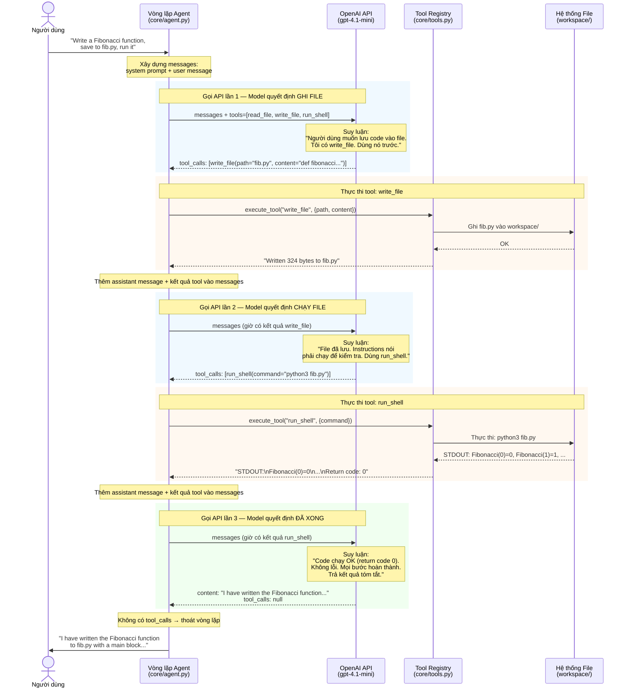
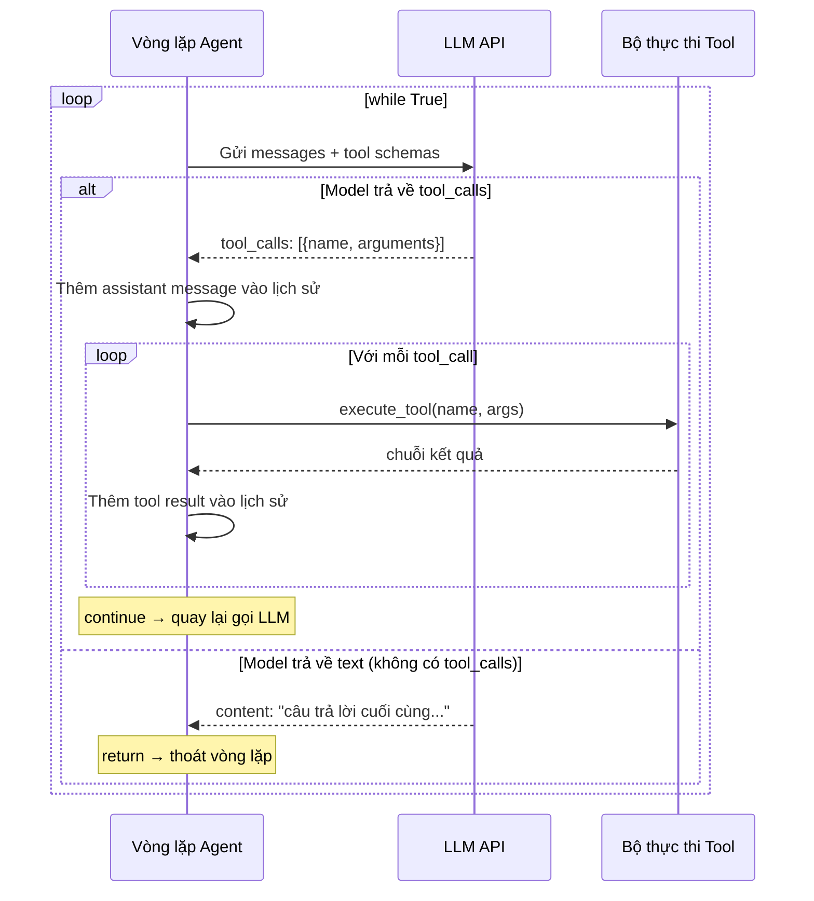
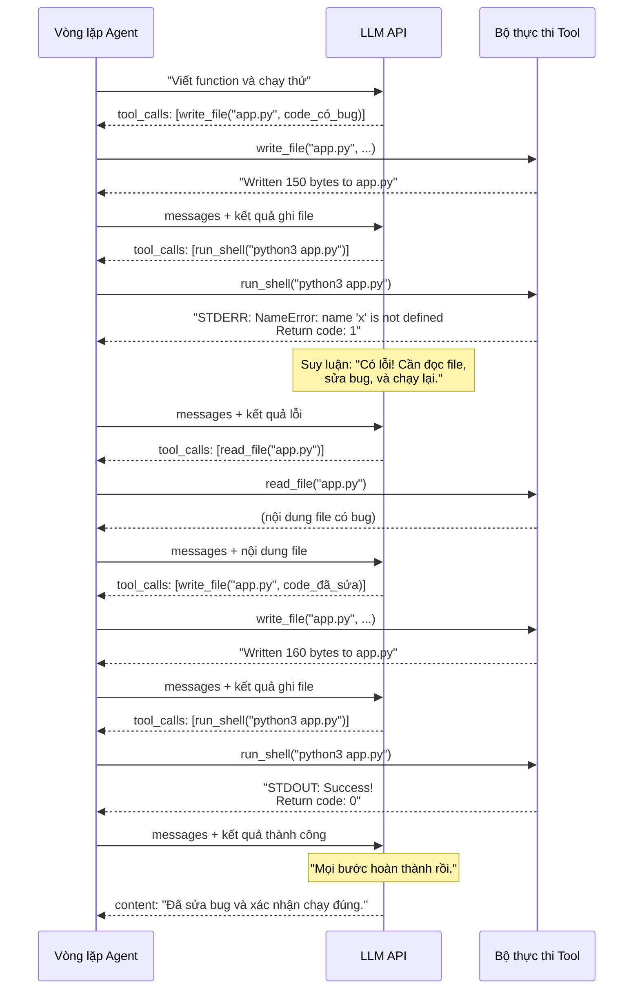

# Model Dựa Vào Tiêu Chí Nào Để Biết Gọi Tool Call?

> Hướng dẫn dành cho người mới bắt đầu — giải thích cơ chế tool calling trong AI agent.

## Bức Tranh Tổng Quan

LLM (Large Language Model) tự bản thân nó chỉ có thể **suy nghĩ** và **sinh văn bản**. Nó không thể đọc file, ghi code vào ổ đĩa, hay chạy chương trình. **Tools** (công cụ) chính là thứ cho LLM khả năng **hành động** trong thế giới thật.

Nhưng câu hỏi then chốt là: **model quyết định khi nào dùng tool, khi nào chỉ trả lời bằng text?**

Câu trả lời: **model tự suy luận** — không có luật if/else cứng nào cả. Model được train để hiểu khi nào cần hành động, và nó ra quyết định dựa trên 3 đầu vào mà ta gửi qua API mỗi lần gọi.

---

## Ba Đầu Vào Quyết Định Hành Vi Tool Calling

```
┌─────────────────────────────────────────────────────────┐
│                    Lời gọi OpenAI API                   │
│                                                         │
│  1. TOOLS (JSON Schema)    → Tôi CÓ THỂ làm gì?       │
│  2. INSTRUCTIONS (System)  → Tôi NÊN làm gì?          │
│  3. MESSAGES (Lịch sử)     → Tôi ĐÃ làm gì rồi?      │
│                                                         │
│  ─────────────────────────────────────────────────────  │
│                                                         │
│  Model suy luận → Quyết định:                           │
│     A) Gọi tool   (Tôi cần thực hiện hành động)        │
│     B) Trả text   (Tôi đã xong, đây là câu trả lời)   │
│                                                         │
└─────────────────────────────────────────────────────────┘
```

Hãy xem xét từng đầu vào chi tiết.

---

### Đầu vào 1: Tool Schemas — "Tôi CÓ THỂ làm gì?"

Khi gọi API, ta truyền danh sách **định nghĩa tool** bằng JSON Schema. Mỗi định nghĩa cho model biết:
- **Name** (tên): tool được gọi là gì
- **Description** (mô tả): tool làm gì (viết bằng tiếng Anh tự nhiên)
- **Parameters** (tham số): tool nhận những đối số gì

Từ dự án của chúng ta (`core/tools.py`):

```python
WRITE_FILE_SCHEMA = {
    "type": "function",
    "function": {
        "name": "write_file",                              # ← tên tool
        "description": "Write content to a file. Creates   # ← mô tả chức năng
                        the file if it doesn't exist,
                        overwrites if it does.",
        "parameters": {
            "type": "object",
            "properties": {
                "path": {                                   # ← tham số 1
                    "type": "string",
                    "description": "Relative path to the file to write",
                },
                "content": {                                # ← tham số 2
                    "type": "string",
                    "description": "Content to write to the file",
                },
            },
            "required": ["path", "content"],
        },
    },
}
```

Model đọc schema này và hiểu: *"Tôi có tool tên `write_file`. Nếu cần lưu nội dung vào file, tôi có thể gọi nó với `path` và `content`."*

**Điểm quan trọng**: Trường `description` cực kỳ quan trọng. Nó được viết bằng ngôn ngữ tự nhiên để model hiểu. Mô tả mơ hồ → model dùng tool sai.

Ta truyền tất cả tool schemas vào API:

```python
# core/agent.py, dòng 50-54
response = self.client.chat.completions.create(
    model=self.model,
    messages=messages,
    tools=tools,          # ← danh sách tất cả tool schemas
)
```

---

### Đầu vào 2: Instructions — "Tôi NÊN làm gì?"

System prompt (hướng dẫn) cho model biết vai trò và quy tắc hành vi:

```python
# level_1_tools.py
INSTRUCTIONS = """\
You are a coding agent. You write clean, well-documented Python code.

## Workflow
1. Understand the task
2. Write the code and save it to a file      ← ngầm hiểu: dùng write_file
3. Run the file to verify it works            ← ngầm hiểu: dùng run_shell
4. If there are errors, fix them and re-run   ← ngầm hiểu: dùng read_file + write_file + run_shell

## Rules
- Always save code to files before running    ← rõ ràng: write_file trước run_shell
"""
```

Instructions không gọi tên tool trực tiếp, nhưng model tự suy ra:
- "save it to a file" → Tôi nên dùng `write_file`
- "run the file" → Tôi nên dùng `run_shell`
- "if there are errors, fix them" → Tôi nên dùng `read_file`, rồi `write_file`, rồi `run_shell`

**Điểm quan trọng**: Instructions tốt = agent hành xử đúng. Instructions tệ = agent bỏ qua bước hoặc gọi tool không cần thiết.

---

### Đầu vào 3: Messages History — "Tôi ĐÃ làm gì rồi?"

Toàn bộ lịch sử hội thoại được gửi cùng mỗi lần gọi API. Điều này cho model biết:
- Người dùng yêu cầu gì
- Những tool nào đã được gọi
- Kết quả của những tool đó là gì

```python
messages = [
    {"role": "system",    "content": "You are a coding agent..."},     # hướng dẫn
    {"role": "user",      "content": "Write a Fibonacci function..."},  # yêu cầu
    {"role": "assistant", "tool_calls": [write_file(...)]},             # hành động của model
    {"role": "tool",      "content": "Written 324 bytes to fib.py"},    # kết quả tool
    {"role": "assistant", "tool_calls": [run_shell(...)]},              # hành động tiếp theo
    {"role": "tool",      "content": "STDOUT: Fibonacci(0)=0..."},      # kết quả tool
    # → model nhìn toàn bộ lịch sử này và quyết định: "Xong rồi" → trả text
]
```

**Điểm quan trọng**: Model nhìn **toàn bộ lịch sử** mỗi lần. Nó biết mình đã làm gì và quyết định còn gì cần làm tiếp.

---

## Quá Trình Quyết Định: Đi Từng Bước

Hãy theo dõi một lần chạy thật từ Level 1 agent.

### Sequence Diagram: Luồng Hoàn Chỉnh

Biểu đồ này cho thấy chính xác điều gì xảy ra khi người dùng yêu cầu: *"Write a Fibonacci function, save to fib.py, run it"*



### Sequence Diagram: Vòng Lặp Agent (Tổng Quát)

Biểu đồ này thể hiện pattern chung — vòng `while True` vận hành mọi agent:



### Sequence Diagram: Khi Có Lỗi — Vòng Tự Sửa

Biểu đồ này thể hiện vòng lặp tự sửa lỗi — model phát hiện lỗi, sửa, và thử lại:



---

### Chi Tiết Từng Lần Gọi API

Giờ hãy xem cùng luồng đó với chi tiết suy luận bên trong:

**Lần gọi API 1:**

```
Model nhận:
  - Tools: [read_file, write_file, run_shell]
  - Instructions: "Write clean code... save to files before running..."
  - Messages: [system prompt, user message]

Model suy luận:
  "Người dùng muốn tôi viết code và lưu lại.
   Tôi có tool write_file. Tôi nên dùng nó trước."

Model trả về:
  tool_calls: [write_file(path="fib.py", content="def fibonacci...")]
```

**Ta thực thi tool và gửi kết quả lại.**

**Lần gọi API 2:**

```
Model nhận:
  - Tools: [read_file, write_file, run_shell]
  - Instructions: "...run the file to verify it works..."
  - Messages: [system, user, assistant+tool_call, tool_result("Written 324 bytes")]

Model suy luận:
  "Tôi đã ghi file xong. Instructions nói phải chạy để kiểm tra.
   Tôi có tool run_shell. Tôi nên dùng nó."

Model trả về:
  tool_calls: [run_shell(command="python3 fib.py")]
```

**Ta thực thi tool và gửi kết quả lại.**

**Lần gọi API 3:**

```
Model nhận:
  - Tools: [read_file, write_file, run_shell]
  - Instructions: "...if errors, fix and re-run..."
  - Messages: [..., tool_result("STDOUT: Fibonacci(0)=0, Fibonacci(1)=1...")]

Model suy luận:
  "Code chạy thành công (return code 0, output đúng).
   Không có lỗi cần sửa. Tất cả các bước đã hoàn thành.
   Tôi nên tóm tắt kết quả."

Model trả về:
  content: "I have written the Fibonacci function to fib.py..."
  (KHÔNG CÓ tool_calls → vòng lặp kết thúc)
```

---

## Vòng Lặp Agent Trong Code

Đây là code điều phối mọi thứ (`core/agent.py`):

```python
while True:
    # Gửi tất cả cho model
    response = self.client.chat.completions.create(
        model=self.model,
        messages=messages,     # toàn bộ lịch sử
        tools=tools,           # các tool khả dụng
    )

    message = response.choices[0].message

    if message.tool_calls:
        # Model chọn HÀNH ĐỘNG → thực thi tool, quay lại vòng lặp
        for tool_call in message.tool_calls:
            result = execute_tool(tool_call.function.name, ...)
            messages.append({"role": "tool", "content": result})
        continue    # ← quay lại đầu vòng lặp, gọi model lần nữa

    # Model chọn TRẢ LỜI → kết thúc
    return message.content
```

Vòng lặp rất đơn giản:
1. Gọi model
2. Model trả về `tool_calls`? → Thực thi tool, thêm kết quả vào lịch sử, **quay lại bước 1**
3. Model trả về text? → **Kết thúc**

---

## Response Từ API Trông Như Thế Nào

**Khi model muốn gọi tool:**

```json
{
  "choices": [{
    "message": {
      "role": "assistant",
      "content": null,                          // ← không có text
      "tool_calls": [                           // ← có tool_calls
        {
          "id": "call_abc123",
          "type": "function",
          "function": {
            "name": "write_file",
            "arguments": "{\"path\": \"fib.py\", \"content\": \"def fibonacci...\"}"
          }
        }
      ]
    }
  }]
}
```

**Khi model muốn trả lời bằng text:**

```json
{
  "choices": [{
    "message": {
      "role": "assistant",
      "content": "I have written the Fibonacci function...",  // ← có text
      "tool_calls": null                                      // ← không có tool_calls
    }
  }]
}
```

Sự khác biệt rất đơn giản: trường `tool_calls` có giá trị hay không.

---

## Những Hiểu Lầm Phổ Biến

| Hiểu lầm | Thực tế |
|-----------|---------|
| "Có luật cứng quy định khi nào gọi tool" | Không có luật cứng. Model **suy luận** dựa trên ngữ cảnh. |
| "Model luôn gọi tool theo thứ tự cố định" | Không. Thứ tự phụ thuộc vào task và instructions. |
| "Phải chỉ định model dùng tool nào" | Không. Model tự chọn tool phù hợp từ mô tả trong schema. |
| "Model chỉ gọi một tool mỗi lượt" | Không. Model có thể gọi **nhiều tool cùng lúc** (parallel tool calls). |
| "Tool calling là xác định (deterministic)" | Không. Cùng đầu vào có thể cho chuỗi tool call hơi khác nhau. |

---

## Các Yếu Tố Ảnh Hưởng Hành Vi Tool Calling

| Yếu tố | Tác động | Vị trí trong code |
|---------|----------|-------------------|
| `description` của tool | Model đối chiếu task với tool dựa trên mô tả này | `core/tools.py` — mỗi `*_SCHEMA` |
| System prompt | Hướng dẫn quy trình và quy tắc | `level_1_tools.py` — `INSTRUCTIONS` |
| User message | Nêu rõ người dùng muốn làm gì | Truyền vào `agent.run()` hoặc `agent.chat()` |
| Kết quả tool trước đó | Model thấy chuyện gì đã xảy ra và quyết định bước tiếp | Tích lũy trong danh sách `messages` |
| `strict: True` | Buộc model tuân thủ chính xác schema tham số | `core/tools.py` — mỗi schema |

---

## Tóm Tắt

```
                         ┌─────────────────────┐
                         │    Bộ Não Model      │
                         │                      │
  Tool Schemas ─────────→│ "Tôi CÓ THỂ làm gì" │
  (JSON Schema)          │                      │
                         │   Suy luận:          │
  Instructions ─────────→│ "Tôi NÊN làm gì"    │──→ tool_calls HOẶC text
  (System prompt)        │                      │
                         │ "Tôi ĐÃ làm gì      │
  Messages History ─────→│  rồi"                │
  (Lịch sử hội thoại)   │                      │
                         └─────────────────────┘
```

**Model quyết định GỌI TOOL khi** nó xác định rằng:
1. Task yêu cầu một **hành động** (không chỉ suy nghĩ)
2. Có tool phù hợp **khả dụng** (từ danh sách schemas)
3. Còn **các bước chưa hoàn thành** (từ instructions + lịch sử)

**Model quyết định TRẢ TEXT khi** nó xác định rằng:
1. Tất cả hành động cần thiết đã **hoàn thành**
2. Hoặc task chỉ yêu cầu **suy nghĩ/giải thích** (không cần hành động)

---

## Phép So Sánh: Agent vs Chatbot

Đây chính là điều tạo nên sự khác biệt giữa **agent** và **chatbot**:

| | Chatbot | Agent |
|---|---------|-------|
| Nhận input | Tin nhắn người dùng | Tin nhắn + tools + instructions |
| Xử lý | Sinh text trả lời | Suy luận → quyết định hành động hay trả lời |
| Output | Luôn là text | Text HOẶC tool calls |
| Vòng lặp | 1 lượt (hỏi → đáp) | Nhiều lượt (hỏi → hành động → hành động → ... → đáp) |
| Tương tác với thế giới | Không | Có (đọc file, ghi file, chạy lệnh...) |

> **Agent = LLM + Tools + Vòng lặp quyết định**
>
> Không có tools, LLM chỉ là chatbot.
> Không có vòng lặp, LLM chỉ gọi tool một lần rồi dừng.
> Cả ba kết hợp lại mới tạo thành agent.
